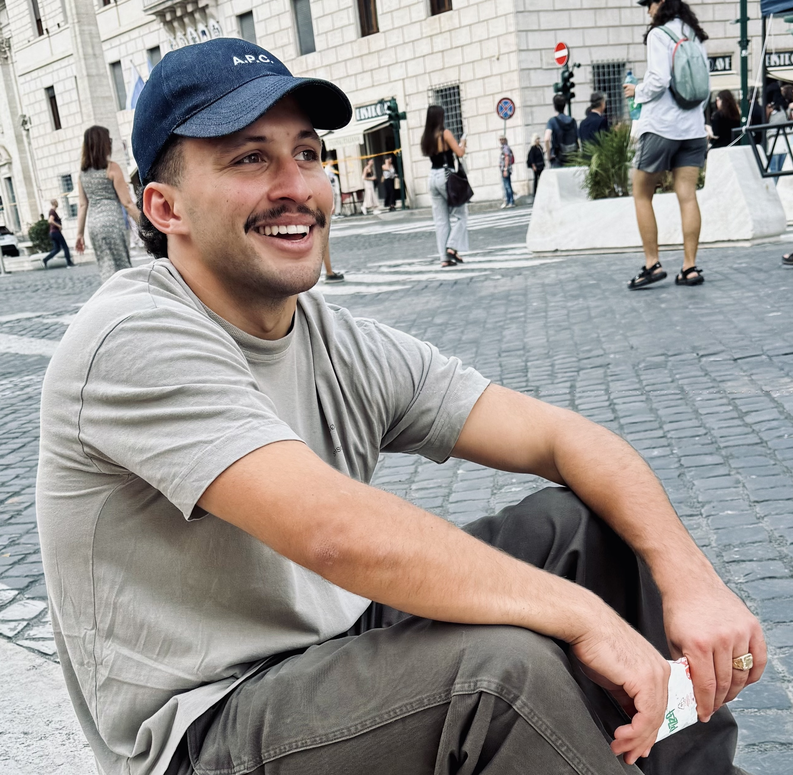

  
  

    
I am a second-year PhD student at the EPFL COMPSEC Lab, where I am advised by <a href="https://ic-people.epfl.ch/~achiesa/">Alessandro Chiesa</a>. Before that, I worked as a Cryptography Researcher at <a href="https://www.nethermind.io/cryptography-research">Nethermind</a> for around 2 years. I have a MASt in Pure Mathematics (Part III) from the University of Cambridge.

    
I am broadly interested in coding theory, the interaction between complexity theory and probabilistic proof/argument systems, and quantum computing.

    
Email: ignacio.manzur@epfl.ch

    
Google Scholar: <a href="https://scholar.google.com/citations?user=phK6lR4AAAAJ&hl=fr&oi=ao">Ignacio Manzur</a>

  

---

## Papers

<!-- Replace the bullets below with your own entries -->
- **All Polynomial Generators Preserve Distance with Mutual Correlated Agreement** [[ePrint]](https://eprint.iacr.org/2025/2051) 
  <small>*Sarah Bordage, [Alessandro Chiesa](https://ic-people.epfl.ch/~achiesa/), [Ziyi Guan](https://ziyiguan.github.io/), __Ignacio Manzur__* </small>

- **FLI: Folding lookup instances** [[ePrint]](https://eprint.iacr.org/2024/1531) 
  <small>*[Albert Garreta](https://sites.google.com/view/agarreta/home?authuser=0), __Ignacio Manzur__* </small> 
  <small>Asiacrypt 2024</small>

- **Mova: Nova folding without committing to error terms** [[ePrint]](https://eprint.iacr.org/2024/1220) 
  <small>*Nikolaos Dimitriou, [Albert Garreta](https://sites.google.com/view/agarreta/home?authuser=0), __Ignacio Manzur__, Ilia Vlasov* </small>

- **On amortization techniques for FRI-based SNARKs** [[ePrint]](https://eprint.iacr.org/2024/661) 
  <small>*[Albert Garreta](https://sites.google.com/view/agarreta/home?authuser=0), Hayk Hovhanissyan, Aram Jivanyan, __Ignacio Manzur__, Isaac Villalobos, Michał Zając* </small>
